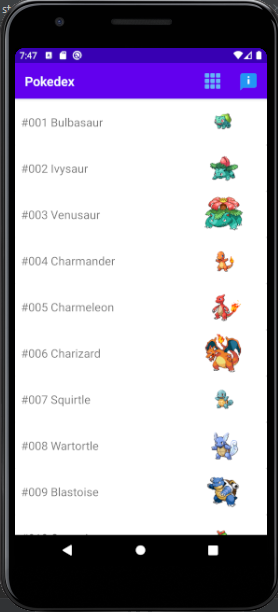
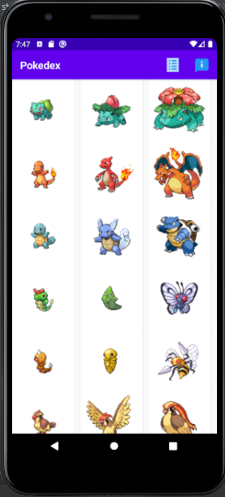
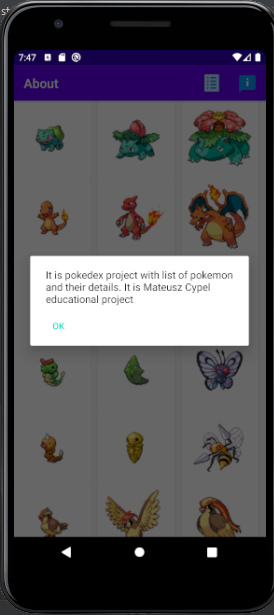
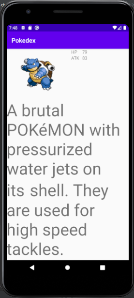

# Pokedex :closed_book:

Pokedex allows checking Pokemon basic stats and descriptions.

This is a educational project which the main purpose was my improvement in Android development.

What was done:
* Dynamically changing welcome background
* Animated button "Click to continue"
* List/Grid RecyclerView
* Downloading data from REST API (Retrofit2, Coroutines)
* Downloading images (Glide)
* Menu bar with buttons (about info, changing layout)

Future improvement:
* Local storage
* Progress bar / Paging
* Some soundtracks from Pokemon game in background
* Data filtering
* REFACTOR (w/ catching exceptions) and improvement layouts

REST API:
* https://pokeapi.co/

Icons from:
* http://icons8.com/

Wallpapers:
* https://androidwalls.net/cartoons/colorful-funny-pokemon-characters-android-wallpaper
* https://wallpapercave.com/w/wp2457789
* https://wallpapercave.com/w/wp5723466